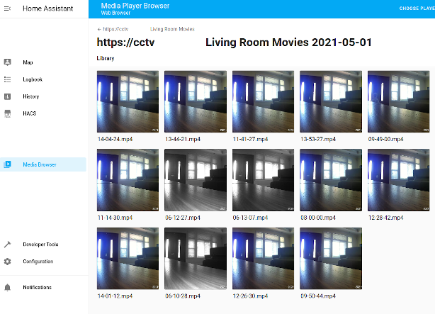

[](https://github.com/dermotduffy/hass-motioneye/releases)
[](https://github.com/dermotduffy/hass-motioneye/actions/workflows/build.yaml)
[](https://app.codecov.io/gh/dermotduffy/hass-motioneye/)
[](LICENSE)
[](https://hacs.xyz)
[](https://www.buymeacoffee.com/dermotdu)

# motionEye Home Assistant Integration

The motionEye integration allows you to integrate your
[motionEye](https://github.com/ccrisan/motioneye) server into Home Assistant. motionEye
is an open source web-frontend for the motion daemon, used to centralize the management
and visualization of multiple types of camera.


## Features

   * Dynamic motionEye camera addition/removal.
   * View motionEye MJPEG video streams as HA camera entities with no additional configuration.
   * Control major motionEye camera options as HA switch entities.
   * Camera motion detection events, and file (image or movie) storage events propagate into
     HA events which can be used in automations.
   * Custom services to set camera overlay text, to trigger motionEye snapshots, and to perform
     arbitrary configured [motionEye Action
     Buttons](https://github.com/ccrisan/motioneye/wiki/Action-Buttons).
   * View saved movies/images straight from the Home Assistant Media Browser.

## Screenshot


## Installation

   * Use [HACS](https://hacs.xyz/) to install to repository:
```
Home Assistant > HACS > Integrations > "Explore & Add Integrations" > motionEye
```
   * Restart Home Assistant.
   * Then install the integration:
```
Home Assistant > Configuration > Integrations > Add Integration -> motionEye
```

### Configuration Variables

|Variable|Description|
| --------------- | ------------------------------------------------------------------------- |
|url|The URL of the motionEye server|
|admin_username|The username of the motionEye administrative account, used for changing camera settings.|
|admin_password|The password of the motionEye administrative account.|
|surveillance_username|The username of the motionEye surveillance user, used to authenticate video streams.|
|surveillance_password|The password of the motionEye surveillance account.|

<a name="options"></a>
## Options

```
Home Assistant > Configuration > Integrations > motionEye > Options
```

* **Configure motionEye webhooks to report events to Home Assistant** [default=`True`]:
  Whether or not motionEye webhooks should be configured to callback into Home
  Assistant. If this option is disabled, no motion detected or file stored events will
  be generated unless the webhooks are manually configured.
* **Overwrite unrecognized webhooks** [default=`False`]: Whether or not to overwrite
  webhooks that are already configured and are not recognized as belonging to this
  integration (web hooks are deemed to belong to this integration if they contain
  `src=hass-motioneye` in the query string).
* [**Advanced**]: **Steam URL template** [default=`None`]: A [jinja2](https://jinja.palletsprojects.com/)
  template that is used to override the standard MJPEG stream URL (e.g. for use with reverse
  proxies). See [Camera MJPEG Streams](#streams) below. This option is only shown to
  users who have [advanced
  mode](https://www.home-assistant.io/blog/2019/07/17/release-96/#advanced-mode) enabled.

## Usage

### Entities

| Platform        | Description                                                               |
| --------------- | ------------------------------------------------------------------------- |
| `camera`        | An MJPEG camera that shows the motionEye video stream.                     |
| `switch`        | Switch entities to enable/disable motion detection, text overlay, video streaming, still image capture and movie capture. |

Notes:
   * If the video streaming switch is turned off, the camera entity will become unavailable (but the rest of the integration will continue to work).
   * As cameras are added or removed to motionEye, devices/entities are automatically added or removed from Home Assistant.

<a name="streams"></a>
#### Camera MJPEG Streams

In order for the MJPEG streams to function they need to be accessible at
`<motioneyehost>:<streaming port>`, i.e. Home Assistant will directly connect to the streaming port
that is configured in the `motionEye` UI (under `Video Streaming`) on the host that the
motionEye integration is configured to use.

Example:
* If this integration is configured to talk to motionEye at `http://motioneye:8765`, and
  a camera is configured to stream on port `8081` -- Home Assistant needs to
  be able to communicate to `motioneye` port `8081`.

##### Stream URL Template

For advanced usecases, this behavior can be changed with the [Steam URL
template](#options) option. When set, this string will override the default stream
address that is derived from the default behavior described above. This option supports
[jinja2 templates](https://jinja.palletsprojects.com/) and has the `camera` dict
variables from motionEye
([example](https://github.com/dermotduffy/hass-motioneye/blob/main/tests/__init__.py#L22))
available for the template. Note that no Home Assistant state is available to the
template, only the camera dict from motionEye.

This is very useful when motionEye is behind a custom configured reverse proxy, and/or
when the stream ports are otherwise not accessible to Home Assistant (e.g. firewall
rules).

###### Stream URL Template Examples

The below are useful examples of how this option may be set.

Use the camera name in the stream URL:

```
http://motioneye/video/{{ name }}
```

Use the camera name in the stream URL, converting it to lowercase first:

```
http://motioneye/video/{{ name|lower }}
```

Use the camera id in the stream URL:

```
http://motioneye/video/{{ id }}
```


### Events

On receipt of a motion or file stored callbacks, events will be fired which can be used
in automations (etc). All event data includes the Home Assistant `device_id` for this
motionEye camera device, and the Home Assistant device `name`. Event data also includes
as many [Motion Conversion
Specifiers](https://motion-project.github.io/motion_config.html#conversion_specifiers)
as make sense for that event type.

Note: Any additional `&key=value` pairs added manually to the motionEye webhook (in the
motionEye UI) will automatically propagate to the event data. If you manually tweak the
web hook, remove the `src=hass-motioneye` parameter or the web hook will be overwritten.
#### Example motion detected event

```json
{
    "event_type": "motioneye.motion_detected",
    "data": {
        "device_id": "662aa1c77657dbc4af836abcdf80000a",
        "name": "Office",
        "camera_id": "2",
        "changed_pixels": "99354",
        "despeckle_labels": "55",
        "event": "02",
        "fps": "24",
        "frame_number": "10",
        "height": "1080",
        "host": "6aa7a495490c",
        "motion_center_x": "314",
        "motion_center_y": "565",
        "motion_height": "730",
        "motion_version": "4.2.2",
        "motion_width": "252",
        "noise_level": "12",
        "threshold": "20736",
        "width": "1920"
    },
    "origin": "LOCAL",
    "time_fired": "2021-04-11T04:25:41.106964+00:00",
    "context": {
        "id": "0320bb897aa3656dbb02affddce322f2",
        "parent_id": null,
        "user_id": null
    }
}
```

#### Example file stored event

```json
{
    "event_type": "motioneye.file_stored",
    "data": {
        "device_id": "662aa1c77657dbc4af836abcdf80000a",
        "name": "Office",
        "camera_id": "2",
        "event": "03",
        "file_path": "/var/lib/motioneye/Camera2/2021-04-10/21-27-53.jpg",
        "file_type": "1",
        "fps": "25",
        "frame_number": "21",
        "height": "1080",
        "host": "6aa7a495490c",
        "motion_version": "4.2.2",
        "noise_level": "12",
        "threshold": "20736",
        "width": "1920"
    },
    "origin": "LOCAL",
    "time_fired": "2021-04-11T04:27:54.528671+00:00",
    "context": {
        "id": "0358cac9457e3e3a2039da8c998e4c25",
        "parent_id": null,
        "user_id": null
    }
}
```

### Services

All services accept either a comma-separated list of entities in `entity_id` or a hex
`device_id`. The `device_id` for a device can be found by visiting the device page:


```
Home Assistant > Configuration > Devices > "Search Devices"
```

Upon opening a given device page, the `device_id` can be found at the end of the URL:

```
https://<home_assistant>/config/devices/device/<device_id>
```

#### motioneye.snapshot

Trigger a camera snapshot (e.g. saving an image to disk).

Parameters:

| Parameter       | Description                                                               |
| --------------- | ------------------------------------------------------------------------- |
| `entity_id` `device_id` |An entity id or device id to set the text overlay on.|

Note: This is a thin wrapper on the [`motioneye.action` call](#action).

<a name="action"></a>
#### motioneye.action

Trigger a motionEye action (see [MotionEye Action Buttons](https://github.com/ccrisan/motioneye/wiki/Action-Buttons)).

| Parameter       | Description                                                               |
| --------------- | ------------------------------------------------------------------------- |
| `entity_id` `device_id`|An entity id or device id to set the text overlay on.|
| `action`|A string representing the motionEye action to trigger. One of `snapshot`, `record_start`, `record_stop`, `lock`, `unlock`, `light_on`, `light_off`, `alarm_on`, `alarm_off`, `up`, `right`, `down`, `left`, `zoom_in`, `zoom_out`, `preset1`-`preset9`|

Note: As of 2021-04-11 the `record_start` and `record_stop` action are not implemented in
motionEye itself and thus do not function in this integration ([relevant code](https://github.com/ccrisan/motioneye/blob/dev/motioneye/handlers.py#L1741)).

#### motioneye.set_text_overlay

Set the text overlay for a camera.

Parameters:

| Parameter       | Description                                                               |
| --------------- | ------------------------------------------------------------------------- |
| `entity_id` `device_id` |An entity id or device id to set the text overlay on.|
| `left_text` `right_text`| One of `timestamp`, `camera-name`, `custom-text` or `disabled` to show a timestamp, the  name of the camera, custom text or nothing at all, on the left or right-hand side.|
| `custom_left_text` `custom_right_text`| Custom text to show on the left or right, if the `custom-text` value is selected.|

Note:
   * Calling this service triggers a reset of the motionEye cameras which will pause the
     stream / recordings / motion detection (etc).
   * Ensure the `Text Overlay` switch is turned on to actually display the configured text overlays.

Example:

```yaml
service: motioneye.set_text_overlay
data:
  left_text: timestamp
  right_text: custom-text
  custom_right_text: "Alarm armed"
target:
  entity_id: camera.office
```

## Media Browsing

Saved motionEye media (movies and images) can be natively browsed from the Home Assistant "Media
Browser".



### Manually Configured Root Directories

Whlst this integration allows drilling down into the media for each camera separately,
underneath motionEye is using the directory structure to associate media items to each
individual camera. Thus if multiple cameras are manually configured to share the same
root directory, motionEye will return the _combination_ of the media items when any one
of the "overlapping" cameras are queried. Use different root directories (in motionEye:
`File Storage -> Root Directory`) to ensure motionEye (and thus this integration) will
correctly associate media with the camera from which that media was captured.

## Debugging

### Debug Logging

To enable debug logging for both the custom component and the underlying client library,
enable the following in your `configuration.yaml` and then restart:

```yaml
logger:
  default: warning
  logs:
    motioneye_client: debug
    custom_components.motioneye: debug
```

## Long-term intention

The goal is to integrate this `custom_component` into Home Assistant Core (non-HACS)
integration. This process has an open-timeline because of the large backlog of code
reviews for Core code submissions, but will probably take at 6-9 months before all of
the functionality would likely be merged in (i.e. goal is to have it merged by the end
of 2021).

As part of that codereview process changes may be necessary (e.g. names and
functionality may change). There no guarantee of seamless migration from HACS -> Core
for users, although that is obviously preferred.

Long-term, once this functionality is fully in Core, this custom component will not be
necessary anymore and will be retired. You can track the PRs that are part of this move
from custom to Core in the [Core Integration Project for
hass-motioneye](https://github.com/dermotduffy/hass-motioneye/projects/3).

## Development

### Updating underlying libraries

   * Update [requirements.txt](https://github.com/dermotduffy/hass-motioneye/blob/main/requirements.txt)
      * Used for CI building.
   * Update [custom_components/motioneye/manifest.json](https://github.com/dermotduffy/hass-motioneye/blob/main/custom_components/motioneye/manifest.json)
      * Used for Home Assistant.
   * Update [.pre-commit-config.yaml](https://github.com/dermotduffy/hass-motioneye/blob/main/.pre-commit-config.yaml)
      * Used for mypy type checking.

### Cutting a new release

* Update
  [custom_components/motioneye/manifest.json](https://github.com/dermotduffy/hass-motioneye/blob/main/custom_components/motioneye/manifest.json)
  with the new version number.
* Edit the draft release on the [Github Releases Page](https://github.com/dermotduffy/hass-motioneye/releases)

## Credits

Thanks to [@oncleben31](https://github.com/oncleben31)'s [Home Assistant Custom
Component
Cookiecutter](https://github.com/oncleben31/cookiecutter-homeassistant-custom-component)
template which was used for the initial skeleton of this component.
